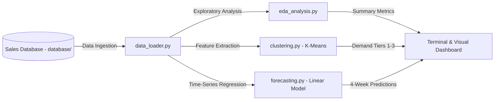

<div align="center">

# 📈 AI & Machine Learning Sales Forecasting System

**An End-to-End Predictive Analytics, Time-Series Forecasting & Demand Clustering System**

[](https://www.python.org/)
[](https://scikit-learn.org/)
[]()
[](https://pandas.pydata.org/)
[](LICENSE)

</div>

---

## 📌 Project Overview

**AI Sales Forecasting System** is a data science and machine learning suite engineered to analyze inventory patterns, segment product demand, and forecast retail sales volume across a 52-week horizon. Utilizing a real-world transaction database of **811 retail products**, the system extracts longitudinal transaction trends, applies **K-Means clustering** for customer demand segmentation, and deploys **linear time-series regression models** to forecast future weekly transaction volumes.

This project was developed for **BTEC Higher National / Level 3 IT - Unit 21: Artificial Intelligence & Data Analytics**, covering the full scope of:
- **Learning Aim A:** In-depth research on AI paradigms, machine learning models, and ethical considerations.
- **Learning Aim B:** Designing, preparing, and cleaning the 52-week sales database and features.
- **Learning Aim C:** Developing the machine learning models (Clustering & Regression), evaluating accuracy metrics (MAE & RMSE), and generating actionable business insights.

---

## 🗄️ Database Architecture & Schema

The underlying database is organized under [`database/`](database/) and stores longitudinal weekly transaction metrics across 811 unique products:

| Database Table / File | Records | Attributes | Description |
| :--- | :--- | :--- | :--- |
| **`raw/Sales_Transactions_Dataset_Weekly_V1.csv`** | 811 | 55 | Raw unnormalized weekly transaction logs (`W0` to `W51`) with MIN/MAX bounds. |
| **`processed/Sales_Transactions_Dataset_Weekly_V2.csv`** | 811 | 107 | Preprocessed dataset with Min-Max normalized features (`Normalized 0` to `Normalized 51`). |
| **`processed/Sales_Transactions_Dataset_Weekly_V3.csv`** | 811 | 107 | Validated production database formatted with standard UTF-8 headers for ML pipelines. |
| **`processed/Sales_Transactions_Dataset_Weekly_V3.xlsx`** | 811 | 107 | Spreadsheet workbook with pivot tables, conditional formatting, and exploratory charts. |

---

## 🧠 Machine Learning Pipeline Architecture

The machine learning pipeline in [`src/`](src/) implements a modular 4-stage workflow:



### Module Breakdown:
1. **`data_loader.py`**: Ingestion layer connecting to the database with schema validation and column extraction.
2. **`eda_analysis.py`**: Statistical profiling calculating overall sales volume (377,931 units), product averages (8.96 units/week), and top-selling SKUs.
3. **`clustering.py`**: Unsupervised K-Means clustering classifying products into 3 distinct velocity tiers (Steady Demand, Medium Velocity, High-Volume Performers).
4. **`forecasting.py`**: Time-series trend regression predicting next 4-week demand per product and evaluating MAE / RMSE accuracy.
5. **`main.py`**: Orchestrates the end-to-end automated pipeline execution.

---

## 📂 Project Structure

```text
ai-sales-forecasting-system/
├── database/                                  # Central Sales Transactions Database
│   ├── raw/
│   │   └── Sales_Transactions_Dataset_Weekly_V1.csv
│   └── processed/
│       ├── Sales_Transactions_Dataset_Weekly_V2.csv
│       ├── Sales_Transactions_Dataset_Weekly_V2.xlsx
│       ├── Sales_Transactions_Dataset_Weekly_V3.csv
│       └── Sales_Transactions_Dataset_Weekly_V3.xlsx
├── docs/                                      # BTEC Unit 21 Reports & Assignment Briefs
│   ├── BTEC_Unit21_Learning_Aim_A_Brief.docx
│   ├── BTEC_Unit21_Learning_Aim_BC_Brief.pdf
│   ├── AI_Research_Report_Aim_A.docx          # Learning Aim A Research Report
│   ├── AI_Project_Implementation_Aim_BC.docx  # Learning Aim B & C Implementation Report
│   └── AI_Project_Draft_Report.docx
├── src/                                       # Modular Python ML Pipeline
│   ├── __init__.py
│   ├── data_loader.py                         # Database connector & preprocessing
│   ├── eda_analysis.py                        # Exploratory Data Analysis & metrics
│   ├── clustering.py                          # K-Means demand segmentation
│   ├── forecasting.py                         # Time-series regression forecasting
│   └── main.py                                # End-to-end execution script
├── requirements.txt                           # Dependencies (pandas, scikit-learn, numpy)
├── LICENSE                                    # MIT License
└── README.md                                  # Comprehensive documentation
```

---

## 🚀 Quickstart & How to Run

### 1. Clone the Repository
```bash
git clone https://github.com/your-username/ai-sales-forecasting-system.git
cd ai-sales-forecasting-system
```

### 2. Install Dependencies
```bash
pip install -r requirements.txt
```

### 3. Run the AI Pipeline
```bash
python src/main.py
```

---

## 📄 License

This project is open-source and licensed under the [MIT License](LICENSE).

---

## 👨‍💻 Author

Developed by **Mamoun Sraiheen**  
*Passionate AI, Data Science & Software Engineering Student*
